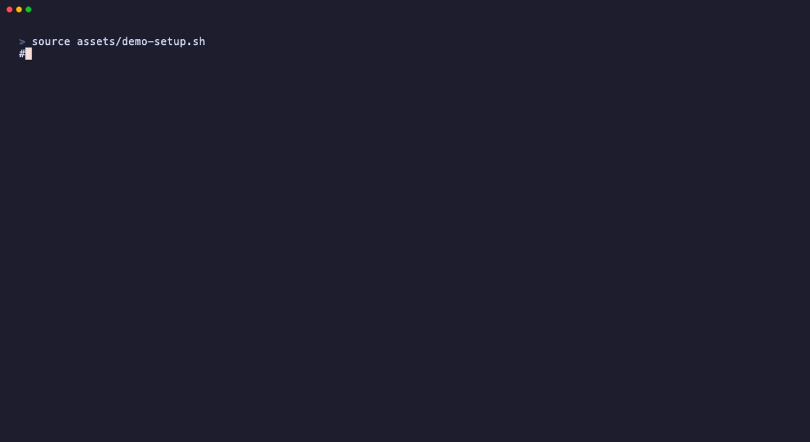

# claude-fleet

<p align="center"></p>

> Run **many parallel [Claude Code](https://claude.com/claude-code) agents** on one git repo — without conflicts.


Coordinate a **fleet of parallel AI coding agents** with **git-worktree branch-ref locks**,
**crash recovery**, a **sequential merge gate**, and **tool-layer guard hooks** — so two agents
never touch the same work, broken branches never reach `main`, and a dead agent never holds a lock.

Then **point the fleet programmatically**: `fleet delegate` hands a work-unit to a **headless,
OS-sandboxed `claude -p` worker** — on *any* provider, including a cheaper model behind an
Anthropic-compatible gateway — `fleet review` runs **N=2 adversarial diff-only reviewers** whose
findings must ship a **runnable repro or patch**, and `fleet fanout` runs many units in parallel
but **refuses a manifest whose units are not provably disjoint**.

The through-line: **workers and reviewers produce evidence; the gate produces verdicts.** An LLM is
never the correctness oracle — your build and test suite are.

Stack-agnostic: the core is pure **shell + python3 + git + gh** (no node/bun); your language and
toolchain specifics live in one small per-repo `config.sh`. Install, update, and remove are all
driven through Claude Code itself.

## Demo


## Why
The git branch ref **is** the lock. Claiming work = `git worktree add` (local mutex)
+ `git push` of `agent/issue-<N>` (server-side compare-and-swap). Two agents — even on
two machines — can never hold the same work. Disjoint file ownership, crash recovery,
and a merge-time build gate close the rest.

## What you get
| Tool | Purpose |
|------|---------|
| `fleet claim <issue>` / `release` | atomic issue claim (lock + worktree + draft PR + labels + ledger); `release` abandons |
| `fleet done <issue>` | post-merge cleanup — worktree + branch + claim, issue stays closed |
| `fleet wt {new,bootstrap,rebase,reap,…}` | worktree lifecycle |
| `fleet integrate <branch> <branches…>` | sequential merge + per-merge gate + rollback |
| `fleet reap [--stale H\|--force]` | reclaim crashed/abandoned claims |
| `fleet delegate {delegate,feedback,loop}` | hand a work-unit to a headless, **OS-sandboxed** `claude -p` worker on any provider; `loop --until '<check>'` self-heals against *your* oracle |
| `fleet delegate review <wt> [--reviewers N]` | **N=2 adversarial, diff-only, READ-ONLY reviewers.** Every finding must ship a runnable repro or patch, adjudicated by the real gate. **Advisory — never blocks** |
| `fleet delegate fanout <manifest> [--jobs N]` | N units in parallel worktrees — **refuses a manifest whose units are not provably disjoint** (a `--jobs` cap cannot rescue overlap) |
| `fleet check` | validate disjoint file ownership |
| `fleet gate-check` | assert the merge gate is still wired (`core.hooksPath`) — a disabled hook cannot object to its own disabling |
| git hooks | block main commits, branch naming, lockfile serialization; non-ff allowed only on CAS-owned agent branches |
| Claude hooks | confine writes to the worktree, block secrets, deny `--no-verify` / main-push / `core.hooksPath` tampering / worktree-wide destructive git, at the tool layer |
| OS sandbox | `sandbox-exec` profile binding **every subprocess** of a headless worker — the Python hooks do not |
| GitHub ruleset | PR-only, no force-push, linear (the authoritative wall) |

## Delegation — point the fleet *programmatically* (`fleet delegate`)
Everything above coordinates **human-driven** agents. `fleet delegate` adds the missing "who
drives the agent" primitive: it hands a self-contained work-unit to a **headless `claude -p`
worker** running inside a fleet worktree. The **orchestrator** (a stronger model, or you) reviews;
the **worker** does the labour.

| Verb | What it does |
|------|--------------|
| `fleet delegate delegate <wt> "<task>"` | run one unit headless in that worktree; capture `session_id` / `result` / cost from `--output-format json` |
| `fleet delegate feedback <wt> "<fix…>"` | `--resume` that worktree's session — continue **in context**, not from a cold start |
| `fleet delegate loop <wt> --until '<check>' "<task>"` | **self-heal**: run → run the check → feed its failure back → repeat, bounded by `--max-iters` (default 3). Exit 0 when the check goes green; non-zero (escalate) when it never does. |
| `fleet delegate review <wt> [--reviewers N] [--base <ref>]` | **N=2 adversarial, diff-only, read-only reviewers.** Every finding must ship a runnable repro or patch; the artifact is *executed* and adjudicated by `fleet_gate`. **Advisory — it never blocks.** |
| `fleet delegate fanout <manifest.json> [--jobs N] [--dry-run] [--resume]` | **N units, one worktree each, run in parallel — but only if they are PROVABLY DISJOINT.** Refuses (exit 2) a manifest whose `owns` globs overlap. Worktrees created *serially*, work run *concurrently*. Exits non-zero iff a unit failed. |

```sh
.fleet/bin/fleet claim 42
.fleet/bin/fleet delegate loop agent/issue-42 --until 'cargo clippy -- -D warnings' \
  "Fix every clippy warning in src/parser.rs. Do not change behaviour."
# → worker runs headless, the check is the oracle, failures are fed straight back in-context
```
The `--until` check is **your** oracle and runs unsandboxed in the worktree — correctness is gated
by the check, not by trusting the worker.

### `review` — reviewers emit **evidence**, the gate returns the **verdicts**
```sh
.fleet/bin/fleet delegate review agent/issue-42               # N=2, diff = origin/main...HEAD
.fleet/bin/fleet delegate review agent/issue-42 --reviewers 3 --base v1.2.0
```
Bun ran exactly this loop over a 535k-line Zig→Rust port: *"1 implementer, 2 or more adversarial
reviewers per implementer. The reviewer's only job: find bugs & reasons why the code does not
work"*, and each reviewer *"gets the diff and nothing else — none of the implementer's reasoning"*.
So: **N defaults to 2** (that is Bun's number, not a derived optimum), the input is
**context-asymmetric** (the diff, never the implementer's session/transcript/rationale — `review`
never passes a session id and never `--resume`s), and the prompt is **refute-framed**: *find the way
this diff is WRONG*.

But review was never Bun's *gate* — their oracle was `cargo check` plus a suite with 1,386,826
assertions. So `review` is built on one rule:

> **Reviewers produce EVIDENCE. `fleet_gate` produces VERDICTS.**

* **Every finding must ship an executable artifact** — a `repro` (a shell command that *fails* on
  HEAD) or a `patch` (a `git apply`-able diff). A finding with neither is **DISCARDED, not
  escalated**: "a vague logic error with no falsifiable counterexample" is exactly what oracle-less
  LLM reviewers over-produce.
* **The artifact is executed**, in a *throwaway* worktree — never in the worktree under review. A
  repro that **passes** on HEAD is `REFUTED` (the bug does not reproduce). A patch that does not
  apply is discarded. A patch that applies but leaves **`fleet_gate`'s outcome unchanged** is
  `UNSUBSTANTIATED` — this is the *fix-guided verification filter*, the one intervention in the
  literature with a measured ~3x improvement in false-rejection rate.
* **`review` never blocks a merge.** It exits **0 whenever it RAN** — findings or no findings.
  A non-zero exit means the review could not run (no sandbox, no worktree, the reviewer died).
  `fleet_gate` and the pre-push hook are **the gate**; `review` is advisory evidence you go and
  verify.
* **Reviewers are READ-ONLY.** They get a *different* sandbox profile from `delegate` workers: the
  worktree **and** the shared `.git` are denied, and the only writable place is a per-reviewer
  scratch dir under `$TMPDIR` where the findings land. A reviewer that can "fix" the diff is no
  longer an independent observer of it.

**Never let the implementer's own model grade its own diff.** That is the one thing you must not
do: the errors correlate, and a model is subject to self-preference bias on its own output. Point
the reviewer at a *different family* — `FLEET_REVIEW_{BASE_URL,MODEL,TOKEN_FILE,TOKEN}`, each
falling back to its `FLEET_WORKER_*` twin when unset. (`review` warns loudly when the two are
identical.) Spend budget on **decorrelation**, not on more reviewers: ten reviewers once
unanimously endorsed an OpenSSL padding oracle that did not exist — they shared a false premise,
and it took *one* instance that actually compiled the code and ran three tests to kill it.

### `fanout` — the ceiling is **I/O and decomposability**, not the model
```sh
.fleet/bin/fleet delegate fanout units.json --dry-run     # validate + preflight, launch nothing
.fleet/bin/fleet delegate fanout units.json --jobs 4      # N workers, N worktrees, in parallel
.fleet/bin/fleet delegate fanout units.json --resume      # re-run only the units that aren't done
```
```json
{ "units": [
    { "id": "parser",  "owns": ["src/parser/**"],  "task": "…" },
    { "id": "codegen", "owns": ["src/codegen/**"], "task": "…" }
] }
```
Schema + a worked example: [`examples/fanout.schema.json`](examples/fanout.schema.json) ·
[`examples/fanout.example.json`](examples/fanout.example.json). Each unit becomes one `delegate` run
(sandbox, `FLEET_WORKER_*` provider, 429/529 retry) on branch `agent/fanout/<manifest>/<id>` in its
own worktree. Per-unit state lives in `.fleet/fanout/<manifest>/` (gitignored) so `--resume` can pick
up after a crash. **A unit's failure does not abort its siblings** — they are disjoint, so they are
independent — but fanout **exits non-zero iff any unit failed**. (`review` is the opposite: advisory,
never blocks. `fanout` is a work-runner. Do not confuse the two.)

**Disjointness is a PRECONDITION, enforced, not advice.** Anthropic pointed **16 agents** at
compiling the Linux kernel with their C compiler
([source](https://www.anthropic.com/engineering/building-c-compiler)):

> *"every agent would hit the same bug, fix that bug, and then overwrite each other's changes.*
> ***Having 16 agents running didn't help because each was stuck solving the same task.***"

N agents on work that isn't genuinely disjoint don't go faster — they duplicate the work and then
**destroy each other's edits**. That is *worse* than N=1, and **no `--jobs` value rescues it**. So
`fanout` **proves** the units' `owns` globs pairwise disjoint before it launches anything — using
`check-claims.py`, fleet's existing ownership gate, driven with a claims manifest synthesised from
the units — and if they collide it **refuses the whole manifest** (exit 2, naming the colliding units
and the offending path) rather than capping and hoping. **Nothing is created: no worktree, no branch,
no worker.** Repartition, don't crank `--jobs`.

**The cap is derived from I/O headroom, not from a number someone liked.** Bun ran ~64 agents over a
535k-line Zig→Rust port ([source](https://bun.com/blog/bun-in-rust)). What broke was never the model:

> *"The machine ran out of disk space and crashed several times anyway"*
> *"One slow `grep` command was all it took to freeze disk reads & writes for minutes."*

Hence: a **disk preflight** before a single worktree is created (`units × FLEET_FANOUT_DISK_MB_PER_JOB`,
default 512 MB — refuses if headroom is short), `nice` on every worker, and `ionice` where it exists.
`--jobs` defaults to `min(cpu_count / 2, 4)` — an intentionally conservative **proxy** for I/O
headroom and an explicit **starting point to tune per machine**, not a measured optimum. No source
gives a measured per-repo parallel-agent ceiling; Bun's ~64 and Anthropic's 16 are anecdotes from two
projects of very different shape. Set it empirically and instrument it.

> **macOS has no `ionice`.** There, `nice` bounds **CPU, not IOPS** — and IOPS is the thing that
> actually bit Bun. On Linux, prefer a real cgroup (`systemd-run --scope -p IOWeight=…`, which is what
> Bun ended up doing) for an I/O bound. fleet won't pretend otherwise.

**Worktrees are created serially; only the work is parallel.** Firing 16 `git worktree add`
concurrently, **4 of 16 failed** on shared-`.git` contention; created serially, 16/16 succeeded.
Concurrent *commits* from separate worktrees are fine — it's creation that races.

### The worker is a separate process — that's the whole trick
`ANTHROPIC_BASE_URL` and `ANTHROPIC_AUTH_TOKEN` are **global per process**. You *cannot* route one
model tier to one provider and another tier elsewhere inside a single Claude Code process — one
process, one endpoint, one credential. Delegation makes multi-provider work possible **precisely
because the worker is spawned as its own process**, so its provider is whatever `FLEET_WORKER_*`
says, entirely independent of the orchestrator you're sitting in. Nothing here is Anthropic-specific:

| env | mapped onto the worker's | |
|-----|--------------------------|-|
| `FLEET_WORKER_BASE_URL` | `ANTHROPIC_BASE_URL` | unset = inherit the ambient default |
| `FLEET_WORKER_TOKEN_FILE` | `ANTHROPIC_AUTH_TOKEN` | a **mode-600** file; never argv, never committed |
| `FLEET_WORKER_MODEL` | `ANTHROPIC_DEFAULT_{OPUS,SONNET,HAIKU}_MODEL` | *all* tiers — the child has **one** endpoint |
| `FLEET_WORKER_TIMEOUT_MS` | `API_TIMEOUT_MS` | default `3000000` |

Worked example — a cheap GLM worker via the z.ai Anthropic-compatible gateway, while your
orchestrator stays on Opus (see [`examples/worker-zai.env.example`](examples/worker-zai.env.example)):
```sh
printf '%s' 'YOUR_TOKEN' > ~/.claudez_token && chmod 600 ~/.claudez_token   # never in the repo
export FLEET_WORKER_BASE_URL=https://api.z.ai/api/anthropic
export FLEET_WORKER_MODEL=glm-5.2
export FLEET_WORKER_TOKEN_FILE=$HOME/.claudez_token
.fleet/bin/fleet delegate delegate agent/issue-42 "…"
```
Leave all four unset and the worker just inherits your normal Anthropic setup. The token is read
from the file and passed to the child **through the environment only** — it never appears in argv
(i.e. never in `ps`), in a log, or in this repo.

Requests are retried with **jittered exponential backoff** on `429`/`529`/transport errors — a
headless fleet against a hosted gateway *will* hit them. A worker that genuinely *failed the task*
is **not** retried; that's what `feedback`/`loop` are for.

### Confinement: an OS sandbox, not the Python hook
The worker runs with `--dangerously-skip-permissions`, so confinement is the whole ballgame — and
**fleet's Python write-guard cannot provide it**. That `PreToolUse` hook binds Claude's own
Write/Edit tools; it does **not** bind arbitrary subprocesses. A `Bash` `echo ESCAPED >
../outside.txt`, a `sed -i`, a `python3 open(…,'w')` all sail straight through it. (Claude Code's
own docs: *"deny rules … don't apply to arbitrary subprocesses that read or write files indirectly
… For OS-level enforcement … enable the sandbox"*.)

So `fleet delegate` wraps every worker in an **OS sandbox** — on macOS, `sandbox-exec` with a
generated profile that denies file-writes outside the worktree, while still allowing the shared
`.git` common dir (or `git commit` from a linked worktree would break), `/tmp`/`$TMPDIR`, and the
`~/.claude` `~/.cache` `~/.npm` caches. Verified: an out-of-worktree redirect, a `python3`
subprocess write, and a write into a **sibling agent's worktree** are all `EPERM`, while
`git commit` inside the worktree still works.

It **fails closed**: `FLEET_DELEGATE_SANDBOX` defaults to `1`, and if the sandbox is unavailable
(`sandbox-exec` missing, or a non-macOS host) `fleet delegate` **dies rather than run a worker
unconfined**. On Linux, use Claude Code's [native sandbox](https://code.claude.com/docs/en/sandboxing)
(`allowUnsandboxedCommands:false` + `failIfUnavailable:true`) — fleet won't fake it. There is a
loud, explicit `FLEET_DELEGATE_SANDBOX=0` opt-out; it prints a large warning, and you should not
use it outside a throwaway box.

> **Never launch a headless agent with `--bare`.** It skips auto-discovery of *all* hooks — and is
> slated to become the `-p` default — so a routine Claude Code upgrade would silently turn every
> fleet hook-rail into a no-op. `fleet delegate` never emits it and refuses to forward it. The
> durable rails (the OS sandbox and the pre-push gate) survive `--bare`; the hook rails do not.

### What each rail actually binds
Be clear-eyed about this: the rails are not equal, and the ones that *look* strongest are the
weakest. If you assume the Python guards confine an agent, you will be wrong.

| Rail | Binds | Survives `--bare`? | Survives a subprocess? | Load-bearing? |
|---|---|---|---|---|
| **OS sandbox** (`sandbox-exec`) | every descendant of the worker | yes | **yes** | **yes** |
| **GitHub ruleset** (server-side) | anything reaching `origin` | yes | yes | **yes** |
| pre-push hook (`core.hooksPath`) | pushes from this client | yes | yes | partly — client-side, so disable-able by whoever controls the client (`fleet gate-check`, #30) |
| `coord-guard` / `worktree-guard` (Claude hooks) | Claude's **own** tool calls | **no** | **no** | no — defence-in-depth |

The Python guards catch Claude's Write/Edit/Bash tool calls. They do **not** see a `python3`,
`node`, `sed -i`, or a nested `claude` that the agent spawns — Claude Code's docs say so plainly.
Treat them as guardrails against *accidents*, never as a boundary against a determined or confused
agent. The only things that hold under a subprocess are the OS sandbox and the server.

**Pin your Claude Code version.** The hook rails depend on undocumented-by-default discovery
behaviour that is explicitly slated to change (`--bare` becoming the `-p` default). Pin the version
the fleet runs, and re-verify the negatives suite (`tests/negatives/`) on every upgrade — it is
designed to fail loudly if a rail has silently become a no-op.

## Requirements
`bash`/`sh`, `git`, `python3` (guards + ownership gate), and `gh` (issue-driven claiming).
No node/bun required by the core. `fleet delegate` additionally needs the `claude` CLI and, on
macOS, `sandbox-exec` (ships with the OS).

## Install — drive it through Claude Code
The lifecycle (install / update / uninstall) runs **through Claude Code**, so `.fleet/config.sh`
and `CLAUDE.md` get *tailored to your repo*: Claude reads your existing `CLAUDE.md` and writes a
fitting section — it never blindly pastes a canned block.

```sh
git clone https://github.com/jellologic/claude-fleet ~/dev/claude-fleet
```
Then open **Claude Code in your target repo** and ask it to install:
> "Install claude-fleet from ~/dev/claude-fleet — follow its INSTALL.md."

Claude then: vendors the machinery (`bash ~/dev/claude-fleet/install.sh .`), tailors `.fleet/config.sh`
to your stack, **authors** a `CLAUDE.md` section (inside `claude-fleet (managed)` markers), creates the
labels, verifies, and holds commit / push / `ruleset` for your approval.

After install, Claude natively knows the tool — through the `CLAUDE.md` section **and** the slash
commands `/claim`, `/release`, `/fleet-update`, `/fleet-uninstall`.

> **Engine, not magic.** `install.sh` only vendors files — idempotent, non-destructive (merges
> `settings.json`, adds marker blocks, preserves `config.sh`, and leaves `CLAUDE.md` to Claude). You
> *can* run it standalone for CI/advanced use, then do the `config.sh` + `CLAUDE.md` steps it prints.

## Configure (per-repo `.fleet/config.sh`)
Two functions are the only stack-specific bits:
- `fleet_bootstrap` — make a fresh worktree runnable (`bun install`, `cargo fetch`, codegen…).
- `fleet_gate "$@"` — gate the integrated tree (units passed as args; empty = full). Return 0/non-zero.

Plus optional vars: `FLEET_MAIN`, `FLEET_LOCKFILE`, `FLEET_GENERATED_RE`, `FLEET_BRANCH_RE`, …

`FLEET_LOCK_STALE_SECS` (default `60`) tunes the coordination mutex: a lock older than this is
*inspected*, not summarily broken — it is only reclaimed if its recorded owner is provably gone
(`kill -0`), so a slow-but-alive holder (a cold `git worktree add`, a big manifest rewrite) keeps
its lock instead of having it stolen mid-critical-section.

## Layout (vendored into your repo)
```
.fleet/{config.sh,lib/,bin/,githooks/,worktrees/,locks/}
.claude/{settings.json,hooks/,commands/,agent-claims.{template,schema}.json}
WORKTREES.md  .worktreeinclude
```

## Remove / update it (clean, no leftovers)
claude-fleet is designed to evict cleanly — it never lives forever in a repo. Drive both through
Claude Code so the `CLAUDE.md` section and config are handled too:
```
/fleet-uninstall      # (or: .fleet/bin/fleet uninstall)  — surgical reverse of install
/fleet-update [path]  # re-vendor a newer claude-fleet, preserving config.sh + CLAUDE.md
```
It removes `.fleet/`, the fleet-only `.claude/` files, **unmerges only its own hooks** from
`settings.json`, strips the managed marker blocks from `.gitignore`/`CLAUDE.md`, and unsets
`core.hooksPath` (only if it's ours). Your own settings, hooks, and ignores are left untouched.
Then review `git status` and commit.

## Found a bug?
Every script carries a one-line **self-report** header pointing to [`SELF-REPORT.md`](SELF-REPORT.md):
understand the issue → check existing issues → file/comment on
[github.com/jellologic/claude-fleet](https://github.com/jellologic/claude-fleet) → propose a fix —
**always with human approval**. This lets a Claude Code agent spelunking the vendored code know
exactly how to surface a problem upstream instead of silently working around it.

## FAQ

**Can I run multiple Claude Code agents / instances on the same repo at once?**
Yes — that's the point. Each agent works in its own **git worktree** on its own branch, and the
branch ref *is* the lock, so two agents (even on two machines) can't grab the same work.

**Won't parallel agents overwrite each other or conflict?**
No. Disjoint worktrees + an atomic claim lock prevent collisions; an optional file-ownership gate
rejects overlapping claims at claim time; and a sequential merge gate rolls back any branch that
doesn't build — so `main` never breaks.

**Does it work with my stack (Rust, Go, Python, Node, TypeScript…)?**
Yes. The core is pure **shell + python3 + git + gh** — no node/bun required. Your build/test/bootstrap
commands live in one small `.fleet/config.sh`.

**Does it commit to `main` or force-push anything?**
Never directly — all work lands via PR. git + Claude Code hooks block `--no-verify`, force-push, and
writes outside your worktree; a GitHub ruleset is the authoritative wall.

**How is this different from just using `git worktree`?**
Worktrees give isolation; claude-fleet adds the **lock** (so agents don't claim the same work),
**crash recovery**, the **merge gate**, and native Claude Code integration (slash commands + CLAUDE.md).

**How do I remove it?**
`/fleet-uninstall` (or `.fleet/bin/fleet uninstall`) — surgical and non-destructive. It never lives forever in your repo.

## Pedigree
Extracted from a production monorepo, where it was stress- and chaos-tested: same-issue races
(8-way local + 2-host compare-and-swap), a 10-agent end-to-end fleet, 80-way ledger concurrency,
25 concurrent worktree creations, `kill -9` mid-claim (no corruption, full self-heal), and an
11-case ownership-gate / reaper suite.

## Contributing
Found a bug or have an improvement? See **[SELF-REPORT.md](SELF-REPORT.md)** — the protocol every
script points to: understand the issue → check existing issues → open one with a repro + root cause
→ propose a fix. (AI agents must get human approval before any outward action.)

## Changelog
See **[CHANGELOG.md](CHANGELOG.md)**.

## License
[MIT](LICENSE) © 2026 jellologic
