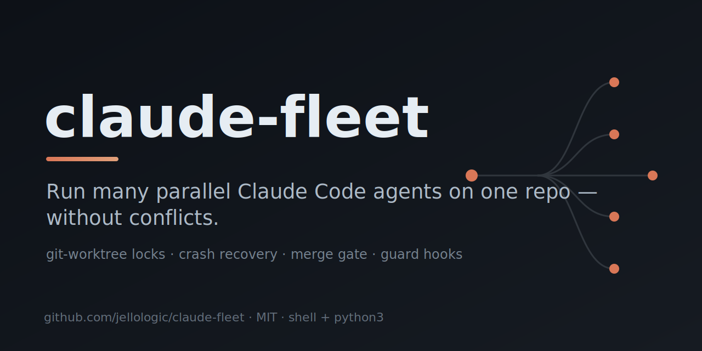

# claude-fleet

<p align="center"></p>

> Run **many parallel [Claude Code](https://claude.com/claude-code) agents** on one git repo — without conflicts.


Coordinate a **fleet of parallel AI coding agents** with **git-worktree branch-ref locks**,
**crash recovery**, a **sequential merge gate**, and **tool-layer guard hooks** — so two agents
never touch the same work, broken branches never reach `main`, and a dead agent never holds a lock.
Stack-agnostic: the core is pure **shell + python3 + git + gh** (no node/bun); your language and
toolchain specifics live in one small per-repo `config.sh`. Install, update, and remove are all
driven through Claude Code itself.

## Why
The git branch ref **is** the lock. Claiming work = `git worktree add` (local mutex)
+ `git push` of `agent/issue-<N>` (server-side compare-and-swap). Two agents — even on
two machines — can never hold the same work. Disjoint file ownership, crash recovery,
and a merge-time build gate close the rest.

## What you get
| Tool | Purpose |
|------|---------|
| `fleet claim <issue>` / `release` | atomic issue claim (lock + worktree + draft PR + labels + ledger); `release` abandons |
| `fleet done <issue>` | post-merge cleanup — worktree + branch + claim, issue stays closed |
| `fleet wt {new,bootstrap,rebase,reap,…}` | worktree lifecycle |
| `fleet integrate <branch> <branches…>` | sequential merge + per-merge gate + rollback |
| `fleet reap [--stale H\|--force]` | reclaim crashed/abandoned claims |
| `fleet check` | validate disjoint file ownership |
| git hooks | block main commits, branch naming, lockfile serialization, force-push |
| Claude hooks | confine writes to the worktree, block secrets, deny `--no-verify`/main-push at the tool layer, session primer |
| GitHub ruleset | PR-only, no force-push, linear (the authoritative wall) |

## Requirements
`bash`/`sh`, `git`, `python3` (guards + ownership gate), and `gh` (issue-driven claiming).
No node/bun required by the core.

## Install — drive it through Claude Code
The lifecycle (install / update / uninstall) runs **through Claude Code**, so `.fleet/config.sh`
and `CLAUDE.md` get *tailored to your repo*: Claude reads your existing `CLAUDE.md` and writes a
fitting section — it never blindly pastes a canned block.

```sh
git clone https://github.com/jellologic/claude-fleet ~/dev/claude-fleet
```
Then open **Claude Code in your target repo** and ask it to install:
> "Install claude-fleet from ~/dev/claude-fleet — follow its INSTALL.md."

Claude then: vendors the machinery (`bash ~/dev/claude-fleet/install.sh .`), tailors `.fleet/config.sh`
to your stack, **authors** a `CLAUDE.md` section (inside `claude-fleet (managed)` markers), creates the
labels, verifies, and holds commit / push / `ruleset` for your approval.

After install, Claude natively knows the tool — through the `CLAUDE.md` section **and** the slash
commands `/claim`, `/release`, `/fleet-update`, `/fleet-uninstall`.

> **Engine, not magic.** `install.sh` only vendors files — idempotent, non-destructive (merges
> `settings.json`, adds marker blocks, preserves `config.sh`, and leaves `CLAUDE.md` to Claude). You
> *can* run it standalone for CI/advanced use, then do the `config.sh` + `CLAUDE.md` steps it prints.

## Configure (per-repo `.fleet/config.sh`)
Two functions are the only stack-specific bits:
- `fleet_bootstrap` — make a fresh worktree runnable (`bun install`, `cargo fetch`, codegen…).
- `fleet_gate "$@"` — gate the integrated tree (units passed as args; empty = full). Return 0/non-zero.

Plus optional vars: `FLEET_MAIN`, `FLEET_LOCKFILE`, `FLEET_GENERATED_RE`, `FLEET_BRANCH_RE`, …

## Layout (vendored into your repo)
```
.fleet/{config.sh,lib/,bin/,githooks/,worktrees/,locks/}
.claude/{settings.json,hooks/,commands/,agent-claims.{template,schema}.json}
WORKTREES.md  .worktreeinclude
```

## Remove / update it (clean, no leftovers)
claude-fleet is designed to evict cleanly — it never lives forever in a repo. Drive both through
Claude Code so the `CLAUDE.md` section and config are handled too:
```
/fleet-uninstall      # (or: .fleet/bin/fleet uninstall)  — surgical reverse of install
/fleet-update [path]  # re-vendor a newer claude-fleet, preserving config.sh + CLAUDE.md
```
It removes `.fleet/`, the fleet-only `.claude/` files, **unmerges only its own hooks** from
`settings.json`, strips the managed marker blocks from `.gitignore`/`CLAUDE.md`, and unsets
`core.hooksPath` (only if it's ours). Your own settings, hooks, and ignores are left untouched.
Then review `git status` and commit.

## Found a bug?
Every script carries a one-line **self-report** header pointing to [`SELF-REPORT.md`](SELF-REPORT.md):
understand the issue → check existing issues → file/comment on
[github.com/jellologic/claude-fleet](https://github.com/jellologic/claude-fleet) → propose a fix —
**always with human approval**. This lets a Claude Code agent spelunking the vendored code know
exactly how to surface a problem upstream instead of silently working around it.

## FAQ

**Can I run multiple Claude Code agents / instances on the same repo at once?**
Yes — that's the point. Each agent works in its own **git worktree** on its own branch, and the
branch ref *is* the lock, so two agents (even on two machines) can't grab the same work.

**Won't parallel agents overwrite each other or conflict?**
No. Disjoint worktrees + an atomic claim lock prevent collisions; an optional file-ownership gate
rejects overlapping claims at claim time; and a sequential merge gate rolls back any branch that
doesn't build — so `main` never breaks.

**Does it work with my stack (Rust, Go, Python, Node, TypeScript…)?**
Yes. The core is pure **shell + python3 + git + gh** — no node/bun required. Your build/test/bootstrap
commands live in one small `.fleet/config.sh`.

**Does it commit to `main` or force-push anything?**
Never directly — all work lands via PR. git + Claude Code hooks block `--no-verify`, force-push, and
writes outside your worktree; a GitHub ruleset is the authoritative wall.

**How is this different from just using `git worktree`?**
Worktrees give isolation; claude-fleet adds the **lock** (so agents don't claim the same work),
**crash recovery**, the **merge gate**, and native Claude Code integration (slash commands + CLAUDE.md).

**How do I remove it?**
`/fleet-uninstall` (or `.fleet/bin/fleet uninstall`) — surgical and non-destructive. It never lives forever in your repo.

## Pedigree
Extracted from a production monorepo, where it was stress- and chaos-tested: same-issue races
(8-way local + 2-host compare-and-swap), a 10-agent end-to-end fleet, 80-way ledger concurrency,
25 concurrent worktree creations, `kill -9` mid-claim (no corruption, full self-heal), and an
11-case ownership-gate / reaper suite.

## Contributing
Found a bug or have an improvement? See **[SELF-REPORT.md](SELF-REPORT.md)** — the protocol every
script points to: understand the issue → check existing issues → open one with a repro + root cause
→ propose a fix. (AI agents must get human approval before any outward action.)

## Changelog
See **[CHANGELOG.md](CHANGELOG.md)**.

## License
[MIT](LICENSE) © 2026 jellologic
